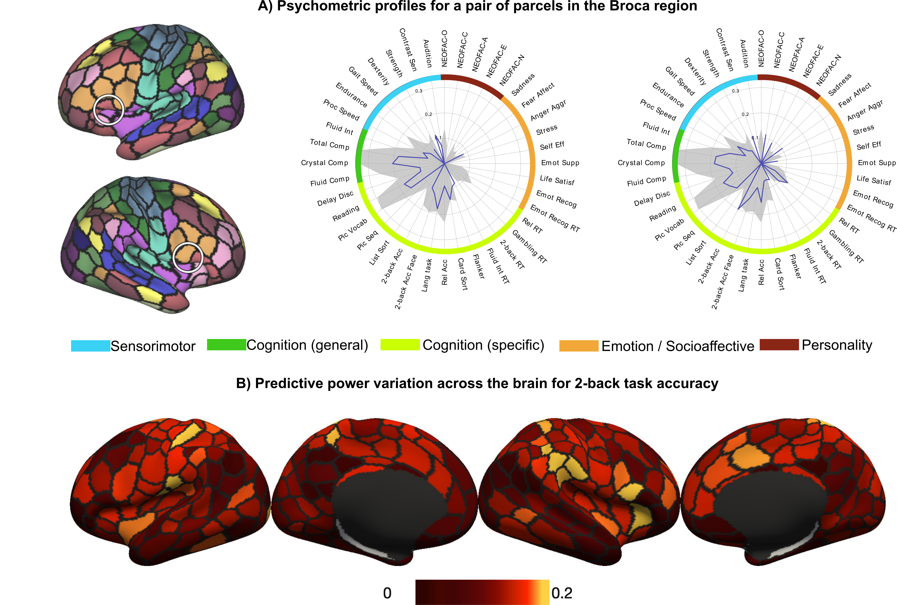
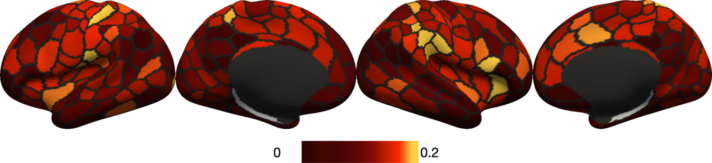

# Connectivity-based Psychometric Prediction (CBPP)

## Reference

Wu J, Eickhoff SB, Hoffstaedter F, Patil KR, Schwender H, Yeo BTT, Genon S. 2021. **A connectivity-based psychometric prediction framework for brain-behavior relationship studies**. Cerebral Cortex. 31(8): 3732-3751. [https://doi.org/10.1093/cercor/bhab044](https://doi.org/10.1093/cercor/bhab044).

Wu J, Eickhoff SB, Li J, Yeo BTT, Genon S. **Replication (or not) of connectivity-based psychometric prediction patterns in distinct population neuroscience cohorts**. *In prep.*

## Background

The CBPP framework is an effort to summarize the general workflow of and systematically assess the common parameters in connectivity-based psychometric prediction studies. Our work consists of 2 aspects:

1. **Whole-brain CBPP**: In the preliminary analysis, we utilised all region-to-region connectivity values for prediction to find the overall best combination of approaches.

2. **Region-wise CBPP**: In order to improve the neurobiological validity (or interpretability) of psychometric prediction models, We propose a parcel-wise prediction approach, where models are trained on each parcel's connectivity profiles separately. We further illustrate 2 applications for this aproach:

    - **single parcel's psychometric profile** (below shows the psychometric profile of a pair of parcels in the Broca region)
    
    </br>
    
    
    - **single psychometric variable's predictive power variation across parcels** (below shows the predictive power variation for 2-back task accuracy)
    
    </br>
    

Later, focusing on the predictive power variation across parcels of fluid cognition and openness, we investigated the generalisability of such region-wise prediction patterns across distinct cohorts.

## Replication

Please see the READMEs in the `HCP_surface_CBPP` and `HCP_volume_CBPP` folders on how to replicate the results in our 2021 paper.

Please see the README in the `generalisability_CBPP` folder on how to replicate the results in our 2022 paper.

## Code Release

We release two Matlab functions, `CBPP_wholebbrain.m` and `CBIG_parcelwise.m`, for implementing any combination of approaches investigated in our paper. 

**Note** that the connectivity and psychometric data should be prepared before using these functions. For computing preprocessing, connectivity, etc. as done in our paper, see the README in `HCP_surface_CBPP` folder. For help on extracting the psychometric data, see the README in `bin/extraction_scripts` folder.

To run whole-brain or parcel-wise CBPP, use the following commands in Matlab:

```matlab
CBPP_wholebrain(fc, y, conf, cv_ind, out_dir, options)
```

```matlab
CBPP_parcelwise(fc, y, conf, cv_ind, out_dir, options)
```

For more detailed usage for each function, use the following commands in Matlab:

```matlab
help CBPP_wholebrain
```
```matlab
help CBPP_parcelwise
```

## Additional Information

1. Flowchart explaining the detailed workflow and cross-validation procedures are in the README file in the `bin/procedure_descriptions` folder.

3. Scripts used to compare different whole-brain CBPP approach and compute statistical significance for parcel-wise CBPP results can be found in the `bin/evaluation_scripts` folder. See the README in the folder for their usage.

## Bugs and Questions

Please contact Jianxiao Wu at jianxiao.wu.veronica@gmail.com.
