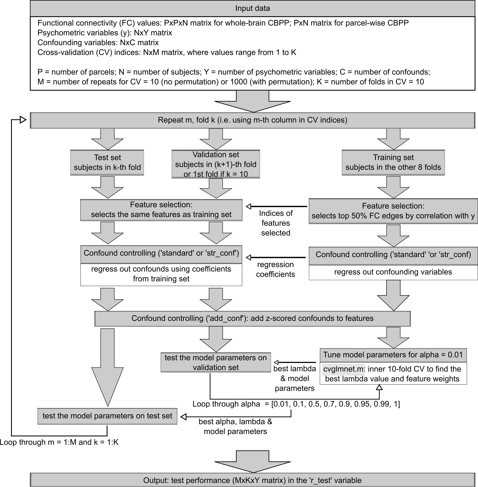

# CBPP Cross-validation (CV) procedure

(Note that either regression for `standard` or `str_conf` or adding to feature for `add_conf` is actually implemented for confound controlling, depending on the `conf_opt` choice, not both; if `conf_opt` set to `no_conf`, then neither is implemented)

The cross-validation procedure without hyperparameter tuning, i.e. for linear Support Vector Regression (SVR) and multiple linear regression (MLR), is as shown below:

The cross-validation procedure with hyperparameter tuning, i.e. for elastic net (EN), is as shown below:

