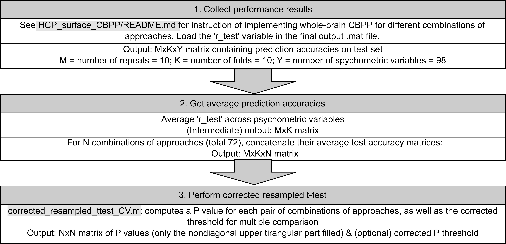

# Evaluation

This folder contains scripts used for quantitative evaluation in the paper. 

## Whole-brain CBPP evaluation

The whole-brain CBPP accuracies of the different combination of approaches are compared using a corrected resampled t-test for cross-validation (CV). The sample variance is corrected in this test to account for the dependency of test sets across CV repeats. 

The script `corrected_resampled_ttest_CV.m` performs the corrected resampled t-test between each pair of input combinations of approaches, then corrects the resulting P values for multiple comparison. The procedure is as shown below:

### Example

To simply compare the performance of SVR-minimal-Pearson and SVR-FIX+GSR-Pearson combinations of approaches at 300-parcel granularity: 

1. **Performance for minimal preprocessing:** 

    i) Follow example 1 in `HCP_surface_CBPP/README.md` for whole-brain CBPP, but adding `-s 1` to the commands in step 4. The final output file should be named `wbCBPP_SVR_standard_HCP_minimal_parc300_Pearson_fixSeed.mat`

    ii) Load the the final output file in i) and compute the average prediction accuracies on test set across psychometric variables: `perf_minimal = mean(r_test, 3)`

2. **Performance for FIX+GSR preprocessing:** 

    i) Follow example 2 in `HCP_surface_CBPP/README.md` for whole-brain CBPP, but adding `-s 1` to the commands in step 4.

    ii) Load the the final output file in i) and compute the average prediction accuracies on test set across psychometric variables: `perf_gsr = mean(r_test, 3)`

3. **Combine performance matrices:** `perf = cat(3, perf_minimal, perf_gsr)`

4. **Perform t-test:** `p = corrected_resampled_ttest_CV(perf)`

Check the P-value by printing the matrix element `p(1, 2)`, which should be `1.5740e-04`.

