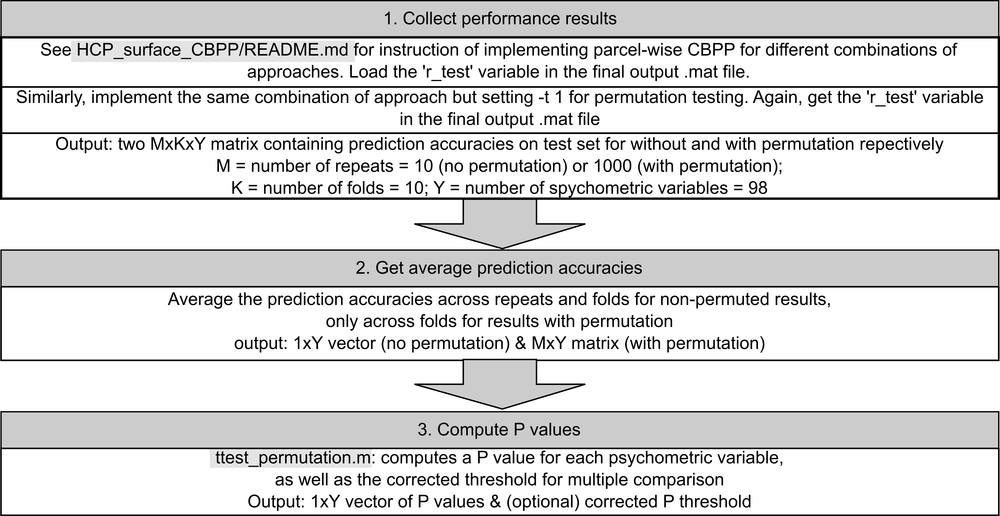

# Evaluation

This folder contains scripts used for quantitative evaluation of whole-brain CBPP results, parcel-wise CBPP results and the effect of denoising on the interpretabbility of parcel-wise CBPP.

## Whole-brain CBPP evaluation

The whole-brain CBPP accuracies of the different combination of approaches are compared using a corrected resampled t-test for cross-validation (CV). The sample variance is corrected in this test to account for the dependency of test sets across CV repeats. 

The script `corrected_resampled_ttest_CV.m` performs the corrected resampled t-test between each pair of input combinations of approaches, then corrects the resulting P values for multiple comparison. The procedure is as shown below:

### Example

To simply compare the performance of SVR-minimal-Pearson and SVR-FIX+GSR-Pearson combinations of approaches at 300-parcel granularity: 

1. **Performance for minimal preprocessing:** 

    i) Follow example 1 in `HCP_surface_CBPP/README.md` for whole-brain CBPP, but adding `-s 1` to the commands in step 4. The final output file should be named `wbCBPP_SVR_standard_HCP_minimal_parc300_Pearson_fixSeed.mat`

    ii) Load the the final output file in i) and compute the average prediction accuracies on test set across psychometric variables: `perf_minimal = mean(r_test, 3)`

2. **Performance for FIX+GSR preprocessing:** 

    i) Follow example 2 in `HCP_surface_CBPP/README.md` for whole-brain CBPP, but adding `-s 1` to the command in step 4. The final output file should be named `wbCBPP_SVR_standard_HCP_gsr_parc300_Pearson_fixSeed.mat`

    ii) Load the the final output file in i) and compute the average prediction accuracies on test set across psychometric variables: `perf_gsr = mean(r_test, 3)`

3. **Combine performance matrices:** `perf = cat(3, perf_minimal, perf_gsr)`

4. **Perform t-test:** `p = corrected_resampled_ttest_CV(perf)`

Check the P-value by printing the matrix element `p(1, 2)`, which should be `1.5740e-04`.

## Parcel-wise CBPP evaluation

The parcel-wise CBPP accuracies for a specific parcel on a range of psychometric variables are tested for singificant by comparing to a null distribution, generated by shuffling the psychometric variables for 1000 repeats of 10-fold cross-validation. These accuracies, with insignificant ones set to 0, can be used to generate the parcel's **psychometric profile**. 

The script `ttest_permutation.m` computes a P value for each psychometric variable from permutation testing, then corrects the P values for multiple comparison. The procedure is as shown below:

### Example

To generate the psychometric profile of parcel 5 from the 300-parcel Schaefer atlas, which is in the primary visual cortex, using SVR-FIX+GSR-Pearson combination of approaches:

1. **Parcel-wise CBPP prediction**: 

    i) Follow example 2 in `HCP_surface_CBPP/README.md` for parcel-CBPP, but adding `-i 5` to the command in step 4. The final output file should be name `pwCBPP_SVR_standard_HCP_gsr_parc300_Pearson_parcel5.mat`

    ii) Load the final output file in i) and compute average prediction accuracies on test set across all folds: `test_perf = squeeze(mean(mean(r_test)))`

2. **Permutation testing**: 

    i) Follow example 2 in `HCP_surface_CBPP/README.md` for parcel-CBPP, but adding `-i 5 -t 1` to the command in step 4. The final output file should be name `null_pwCBPP_SVR_standard_HCP_gsr_parc300_Pearson_parcel5.mat`

    ii) Load the final output file in i) and compute average prediction accuracies on test set across all folds: `null_perf = squeeze(mean(r_test, 2))`

3. **Test significance**: `[p, p_thr] = ttest_permutation(test_perf, null_perf)`

## Effect of denoising on parcel-wise CBPP

The script `compare_pwCBPP_denoising.m` can be used to statistically compare the effect of denoising on the distribution of parcel-wise CBPP prediction accuracies 
across all parcels. The procedure and details of the 3 tests performed are as shown below:

### Example

To compare the minimal preprocessing and FIX+GSR preprocessing options, using SVR-Pearson combinations of approaches at 300-parcel granularity:

1. **Parcel-wise CBPP prediction:**: follow example 1 and 2 in `HCP_surface_CBPP/README.md` for parcel-wise CBPP, generating in total 600 .mat files in `/path/to/results/dir`

2. **Combine performance results**:

    i) Combine minimal preprocessing results: `for parcel in 1:300; combine_CBPP_results('/path/to/results/dir', ['pwCBPP_SVR_standard_HCP_minimal_parc300_Pearson_parcel' num2str(parcel)], '/path/to/results/dir'); end`

    ii) Combine FIX+GSR preprocessing results: `for parcel in 1:300; combine_CBPP_results('/path/to/results/dir', ['pwCBPP_SVR_standard_HCP_gsr_parc300_Pearson_parcel' num2str(parcel)], '/path/to/results/dir'); end`

3. **Perform comparisons**: `compare_pwCBPP_denoising('/path/to/results/dir', 300, 'SVR_standard_HCP_minimal_parc300_Pearson', 'SVR_standard_HCP_gsr_parc300_Pearson')`
