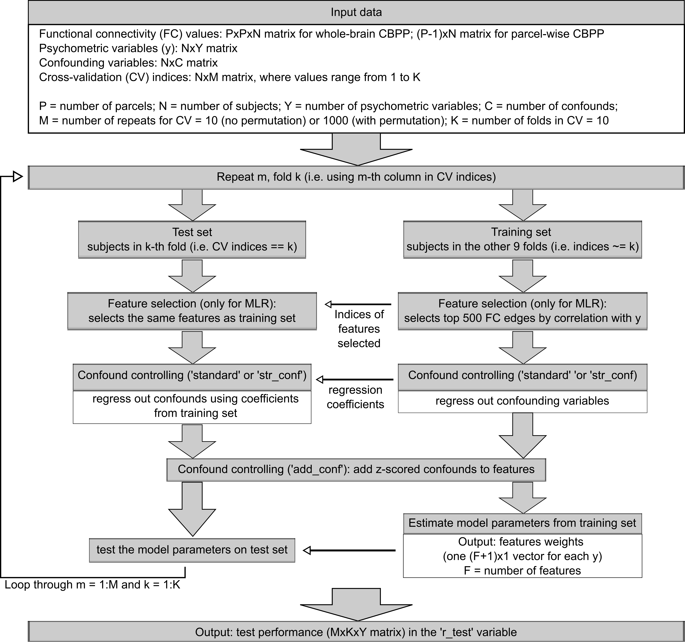
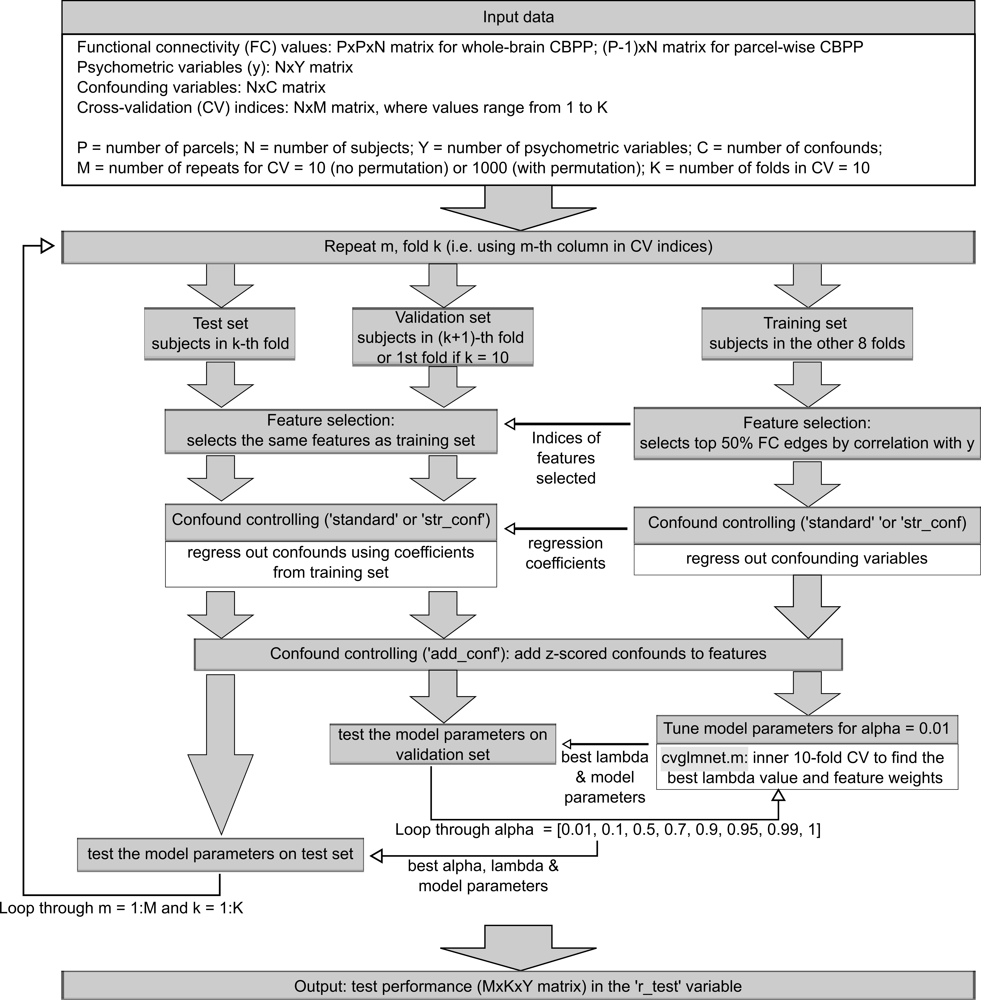

# CBPP procedures

1. **Overall procedure**: CBPP implementation procedure using HCP surface data

2. **cross-validation procedure without hyperparameter tuning**: i.e. for linear Support Vector Regression (`SVR`) and multiple linear regression (`MLR`)

3. **cross-validation procedure with hyperparameter tuning**: i.e. for elastic net (EN)

